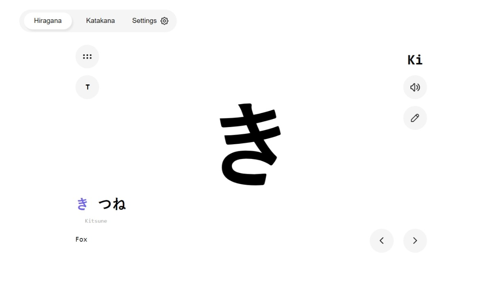

# LoFi Engine

    

Learn Japanese Hiragana and Katakana. Memorize, write, pronounce, and test your knowledge.

## Features 
* Both alphabets of Japanese: **Hiragana** and **Katakana**.
* Light and Dark theme.
* English and Arabic support.
* Works with major desktop platforms *Linux,* *Mac,* and *Windows*.
* and More...
### Rich Content
1. **Writing**: Learn how to write all characters with detailed animations.
2. **Pronounciatin**: Listen to the carefully crafted alphabet pronounciation to learn how to utter each character perfectly.
3. **Tests**: Challenge yourself and test your knowledge with trackable scoring system.
### Keyboard Accessible
Any actions or clicks you can do with the mouse there is a shortcut for it with the keyboard.
## Future Plan
Add kanji support. Duolingo is very good by the way.
## License
MIT

